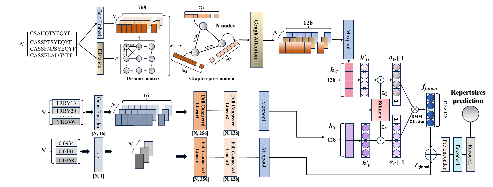

# GATTCR

GATTCR: A Graph Attention Network with Multi-Feature Fusion for Peripheral Blood TCR Repertoire Classification
------------------------------

## Introduction
GATTCR is a graph-based deep learning framework designed for T-cell receptor (TCR) repertoire classification from peripheral blood samples. It integrates Graph Attention Networks (GATs) with multi-feature fusion—including sequence embeddings (via TCR-BERT), clonal frequency, and V gene usage—to model complex inter-clonal relationships and immune signatures. GATTCR offers a scalable, non-invasive approach to immune state classification and holds promise for applications in early disease detection and personalized immunotherapy.

<p float="left">
  
</p>

## Instructions

### Clone the repository
git clone [https://github.com/fdu-wangfeilab/GATTCR.git](https://github.com/fdu-wangfeilab/GATTCR.git)

### Install dependencies
pip install -r requirements.txt

### Usage

#### Data processing

First, we need to collect the raw TCR-sequencing data files in one directory, such as `./Data/RawData/Example_raw_file.tsv`, and use the Python script `./Codes/preprocess.py` to process them by this command:

```
python ./Codes/preprocess.py --sample_dir ./Data/RawData/ --info_index [-3,5,2] --aa_file ./Data/AAidx_PCA.txt --save_dir ./Results/ProcessedData/
```

After processing, TCRs with their information are saved in `./Results/ProcessedData/RawData/0/Example_raw_file.tsv_processed.tsv`:

```
amino_acid  v_gene  frequency
CASSLTRLGVYGYTF TRBV6-6*05  0.06351
CASSKREIHPTQYF  TRBV28*01(179.7)    0.043778
CASSLEGGAAMGEKLFF   TRBV28*01(194.7)    0.039882
CASSPPDRGAFF    TRBV28*01(179.5)    0.034422
CASSTGTAQYF TRBV19*03   0.028211
CASSEALQNYGYTF  TRBV2*01(255.6) 0.027918
CSARADRGQGYEQYF TRBV20-1*01 0.027427
CASSPWAATNEKLFF TRBV28*01(179.7)    0.023224
CAWGWTGGTYEQYF  TRBV30*05   0.019363
······
```

#### Prediction

Modify the .npy path at #592 to save the distance matrix of the test set in ./Codes/caRepertoire_prediction.py.

Pass the TCRBert model path at line #3644 to load the TCRBert model in ./Codes/network_test_fold.py.

Then, we can use the Python script `./Codes/train_test_fold.py` to make predictions on the sample set 0 `./Data/Geneplus/THCA/0/` using the pre-trained model by this command:

```
python ./Codes/train_test_fold.py --network Mulgat_vgene_fusion_freq --mode 0 --sample_dir ./Data/Geneplus/THCA/test --aa_file ./Data/AAidx_PCA.txt --model_file ./Results/THCA_5_fold.pth --record_file ./other/caTCR_THCA_test.pth_overlap.tsv
```

The metric are calculated and printed as: 

```
ACC = 0.933 ± 0.023
RECALL = 0.978 ± 0.020
SPECIFICITY = 0.898 ± 0.037
MCC = 0.869 ± 0.043
AUC = 0.989 ± 0.005
AUPR = 0.985 ± 0.006
```

#### Training

Modify the .npy path at #729 to save the distance matrix of the training set in ./Codes/train_test_fold.py.

Pass the TCRBert model path at line #3454 to load the TCRBert model in ./Codes/network_test_fold.py.

Then users can use the Python script `./Codes/train_test_fold.py` to train their own GATTCR models on their TCR-sequencing data samples for a better prediction performance. For example, we can train the model on the THCA sample sets 1, 2, 3 and 4, by this command:

```
python ./Codes/train_test_fold.py --network Mulgat_vgene_fusion_freq --mode 1 --sample_dir "['./Data/Geneplus/THCA/train/']" --aa_file ./Data/AAidx_PCA.txt --model_file ./Results/THCA_5_fold.pth
```

After the training process, the final model can be found in `./Results/Geneplus/THCA/GATTCR_THCA_test0.pth`

#### Ablation Studies

##### Receptor Count Selection

###### Training:

Modify the --tcr_num parameter to 100, 200, 300, and 400 in ./Codes/train_test_fold.py.

```
python ./Codes/train_test_fold.py --network Mulgat_vgene_fusion_freq --mode 1 --sample_dir "['./Data/Geneplus/THCA/train/']" --aa_file ./Data/AAidx_PCA.txt --model_file ./Results/THCA_num_100_5_fold.pth
```

###### Predicting
```
python ./Codes/train_test_fold.py --network Mulgat_vgene_fusion_freq --mode 0 --sample_dir ./Data/Geneplus/THCA/test --aa_file ./Data/AAidx_PCA.txt --model_file ./Results/THCA_num_100_5_fold.pth
```

##### Number of GAT Layers
Modify the --num_gat_layers parameter to 1, 2 and 3 in ./Codes/network_test_fold.py.

##### GAT only

###### Training
```
python ./Codes/train_GAT_only.py --network Mulgat_vgene_fusion_freq --mode 1 --sample_dir "['./Data/Geneplus/THCA/train/']" --aa_file ./Data/AAidx_PCA.txt --model_file ./Results/THCA_GAT_only_fold.pth
```

###### Predicting
```
python ./Codes/train_GAT_only.py --network Mulgat_vgene_fusion_freq --mode 0 --sample_dir ./Data/Geneplus/THCA/test --aa_file ./Data/AAidx_PCA.txt --model_file ./Results/THCA_GAT_only_fold.pth --record_file ./other/caTCR_THCA_test.pth_overlap.tsv
```

##### GAT + gene

###### Training
```
python ./Codes/train_GAT+gene.py --network Mulgat_vgene_fusion_freq --mode 1 --sample_dir "['./Data/Geneplus/THCA/train/']" --aa_file ./Data/AAidx_PCA.txt --model_file ./Results/THCA_GAT+gene_fold.pth
```

###### Predicting
```
python ./Codes/train_GAT+gene.py --network Mulgat_vgene_fusion_freq --mode 0 --sample_dir ./Data/Geneplus/THCA/test --aa_file ./Data/AAidx_PCA.txt --model_file ./Results/THCA_GAT+gene_fold.pth --record_file ./other/caTCR_THCA_test.pth_overlap.tsv
```

##### GAT + freq

###### Training
```
python ./Codes/train_GAT+freq.py --network Mulgat_vgene_fusion_freq --mode 1 --sample_dir "['./Data/Geneplus/THCA/train/']" --aa_file ./Data/AAidx_PCA.txt --model_file ./Results/THCA_GAT+freq_fold.pth
```

###### Predicting
```
python ./Codes/train_GAT+freq.py --network Mulgat_vgene_fusion_freq --mode 0 --sample_dir ./Data/Geneplus/THCA/test --aa_file ./Data/AAidx_PCA.txt --model_file ./Results/THCA_GAT+freq_fold.pth --record_file ./other/caTCR_THCA_test.pth_overlap.tsv
```


